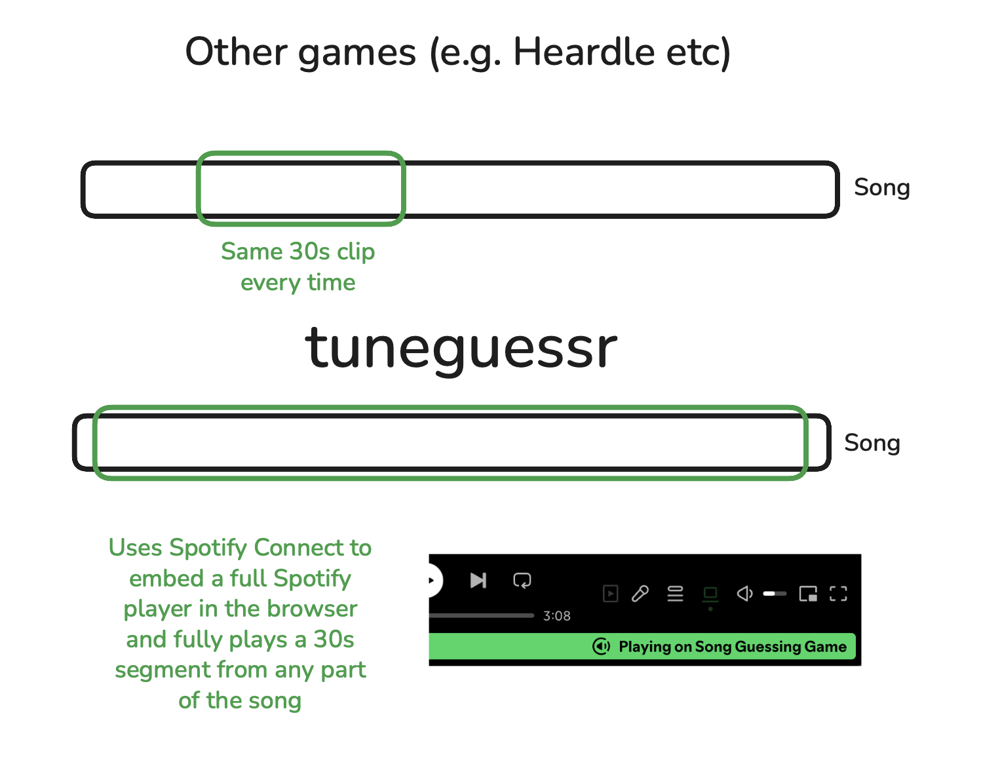

# tuneguessr

This is a project I built to enjoy trying to guess what song is being played to you. The project has evolved *lots* - it initially started as a react native application and has eventually ended up as a super simple client side only single page web application. 

Now, heres the issue - spotify bans games, see [here](https://developer.spotify.com/policy#iii-some-prohibited-applications) 

"Do not create a game, including trivia quizzes."

This sadly prevents me from setting up a public version of this that anyone can freely use, however I will detail setup instructions if you would still like to play or test it out, it is quite fun and addictive - especially with those albums you know really well.

# [view demo](https://www.youtube.com/watch?v=zbDU0qnwpSY)

## Techologies used
* ReactJS
* Vite
* Tailwind
* Zustand

# 

Unlike many other song guessing games I have come across, this will use a unique 30 second stretch of the song, as most other similar apps I have found make use of spotifys now depracated Preview URL system, which gives you an unauthenticated route for a 30 second preview sample of a song. I originially wanted to use this but upon realising it would not be suitable for what I wanted, I had to pivot and move to the authorization code with pcke flow with the Spotify Web Playback SDK which adds the browser game to your spotify account's players, loads up a song and switches to that player. This is why sometimes it takes an additional reload or two for the play button to work, sometimes the web playback sdk isn't happy and I haven't found many reliable ways to work with it.

## Setup your own instance

Setup is quite trivial, I will outline the basic steps:
- Make sure you have a spotify account and head to the developer dashboard, where you should create a new application. Add the url you will host the instance and then /callback.html
- Copy the client ID and callback into the src/spotify/auth.js file
- Build using npm run build
- You can now either host it using the static files produced, or you can host it using docker. (I have not yet published a public instance where you can configure params such as the spotify info, however if demand exists I will do this) 
